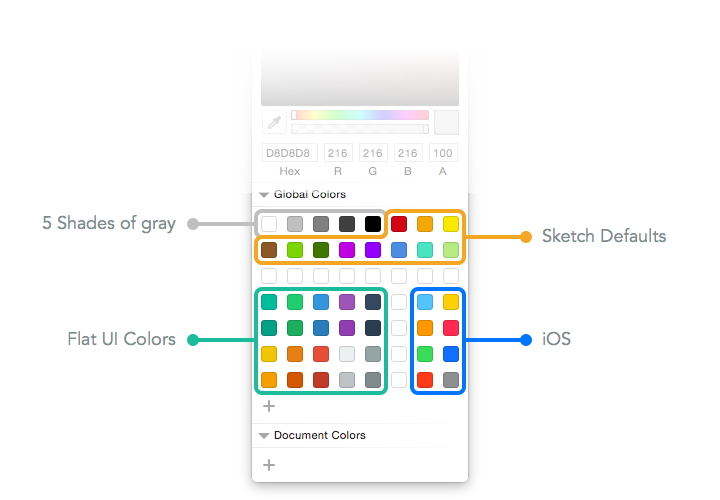

# My Sketch Colors


This is my color preset in Sketch app.

You can grab it if you like.




# Installation

Copy and paste the following commands into Terminal and press return to run.


```
cd ~/Library/Containers/com.bohemiancoding.sketch3/Data/Library/Application\ Support/com.bohemiancoding.sketch3/
mv assets-v55.sketchpreset assets-v55.sketchpreset.backup
curl -O https://github.com/RayPS/my-sketch-colors/raw/master/assets-v55.sketchpreset
echo "All Done! Now restart Sketch app."
```

Notice: this will replace your colors. You can also [restore your colors](https://github.com/RayPS/my-sketch-colors/wiki/Restore-my-colors) if you regret it.


# Contribution

If you got any better ideas,
Just send me a pull request or add an issue.
